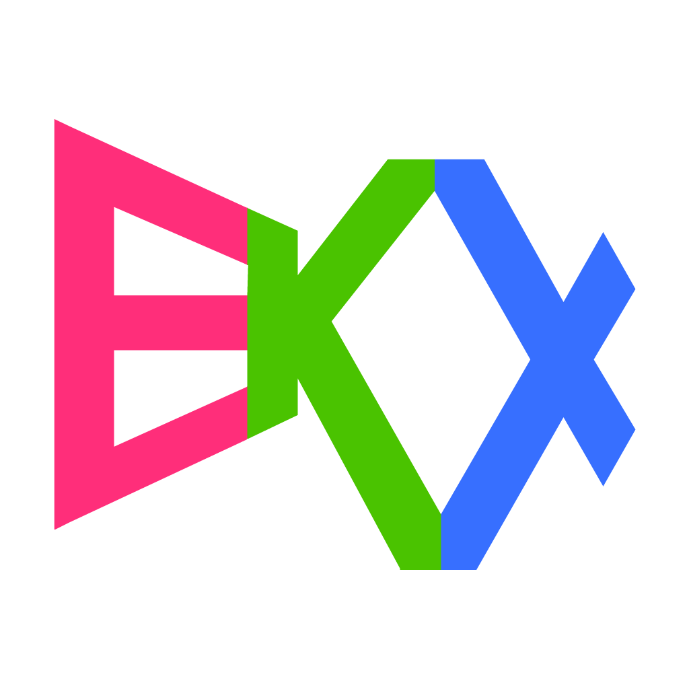

## Toy game engine

## Showcase

- **EKX Demo**
  | [Web](https://play-ilj.web.app/)
  | [GooglePlay](https://play.google.com/store/apps/details?id=ilj.play.demo)
- **Sense of Color**
  | [GooglePlay](https://play.google.com/store/apps/details?id=com.eliasku.odd_color_sense_vision_test_challenge)
  | [AppStore](https://apps.apple.com/us/app/sense-of-color/id1435111697)
  | [Web](https://odd-color-sense.web.app/)
- **Duckstazy**
  | [GooglePlay](https://play.google.com/store/apps/details?id=com.eliasku.Duckstazy)
  | [AppStore](https://apps.apple.com/us/app/duckstazy-classic/id1465702917)
  | [Web](http://duckstazy-2018.web.app/)
- **Dice Twice 2048**
  | [GooglePlay](https://play.google.com/store/apps/details?id=com.eliasku.dice_twice_2048_domino_puzzle)
  | [Web](https://dice-twice-2048.web.app/)
- **I Have To Flap**
  | [Web](https://ihavetoflap.web.app/)
  | [Google Play](https://play.google.com/store/apps/details?id=i.have.to.flap&hl=en&gl=US)

## Status

- Android: app export
- iOS: app export
- Web: app export
- macOS: dev
- Linux: dev (WIP)
- Windows: dev (WIP)
